<div align="center">

# 🔐 Production Domain RAG System

### Retrieval-Augmented Generation with hybrid search, grounding, citations & multi-tenant security

**FastAPI** · **PostgreSQL + pgvector** · **Redis** · **Hybrid Retrieval** · **RRF + Reranking** · **Multi-Tenant**

[](#)
[](#)
[](#)
[](#)
[](#)
[](#)
[](#)
[](#)
[](#-license)

> ⚠️ **Integrity note:** this README deliberately contains **no hard-coded test counts, benchmark scores, latency figures or "production-ready" claims**.
> All such numbers must be generated from the *current* commit and recorded in [Verification Results](#-verification-results). See [Verification Policy](#-verification-policy).

</div>

---

## 📊 At a Glance

<table>
<tr>
<td width="50%" valign="top">

**🎯 What it does**

Answers questions **only** from an explicitly retrievable knowledge source — never from unconstrained model generation — and returns every answer with **traceable citations**.

</td>
<td width="50%" valign="top">

**🔒 Why it's different**

Security is treated as an architectural boundary, not a feature: tenant isolation, server-side authority, fail-closed controls, and grounding that **cannot be disabled by a client**.

</td>
</tr>
<tr>
<td width="50%" valign="top">

**🧩 Architecture**

Clean / hexagonal layering. Retrieval, storage, auth, generation and infrastructure are **independently replaceable and independently testable**.

</td>
<td width="50%" valign="top">

**🔍 Retrieval**

Hybrid **dense + lexical** search, fused with **Reciprocal Rank Fusion**, then **reranked** — so exact tokens *and* semantic meaning both survive.

</td>
</tr>
</table>

---

## 🧭 Reader's Guide

Pick your path — you don't need to read all of it.

<table>
<tr>
<td width="33%" valign="top">

### 👔 Recruiter / Reviewer
**~3 minutes**

1. [At a Glance](#-at-a-glance)
2. [Key Features](#-key-features)
3. [Tech Stack](#-tech-stack)
4. [System Architecture](#-system-architecture)
5. [Resume-Relevant Highlights](#-resume-relevant-engineering-highlights)

</td>
<td width="33%" valign="top">

### 🛠️ Engineer / Contributor
**~15 minutes**

1. [Quick Start](#-quick-start)
2. [RAG Pipeline](#-the-rag-pipeline)
3. [Storage Architecture](#-storage-architecture)
4. [API](#-api)
5. [Development Commands](#-development-commands)
6. [Project Structure](#-project-structure)

</td>
<td width="33%" valign="top">

### 🔐 Security Reviewer
**~10 minutes**

1. [Security Architecture](#-security-architecture)
2. [Threat Model](#-threat-model)
3. [Trust Boundaries](#-trust-boundaries)
4. [Security Verification](#-security-verification)
5. [Known Limitations](#-known-limitations)
6. [Security Disclaimer](#-security-disclaimer)

</td>
</tr>
</table>

---

## 📑 Table of Contents

<details>
<summary><b>Click to expand the full table of contents</b></summary>

<br>

**Getting Started**
- [📊 At a Glance](#-at-a-glance)
- [🧭 Reader's Guide](#-readers-guide)
- [❓ Problem Statement](#-problem-statement)
- [🎯 Objectives](#-objectives)
- [✨ Key Features](#-key-features)
- [🧰 Tech Stack](#-tech-stack)
- [🚀 Quick Start](#-quick-start)

**Architecture**
- [🏗️ System Architecture](#-system-architecture)
- [🔄 The RAG Pipeline](#-the-rag-pipeline)
- [🧠 Query Processing](#-query-processing)
- [🔀 Hybrid Retrieval](#-hybrid-retrieval)
- [🧲 Dense Retrieval](#-dense-retrieval)
- [🔤 Lexical Retrieval](#-lexical-retrieval)
- [⚖️ Reciprocal Rank Fusion](#-reciprocal-rank-fusion)
- [🎯 Reranking](#-reranking)
- [📦 Context Construction](#-context-construction)
- [🔗 Grounding & Citations](#-grounding--citations)
- [📥 Document Ingestion](#-document-ingestion)

**Security**
- [🛡️ Security Architecture](#-security-architecture)
- [🔑 Authentication & Authorization](#-authentication--authorization)
- [🏢 Multi-Tenant Architecture](#-multi-tenant-architecture)
- [🗝️ API Key Handling](#-api-key-handling)
- [📤 Upload Security](#-upload-security)
- [🚦 Rate Limiting](#-rate-limiting)
- [🎭 Threat Model](#-threat-model)
- [🚧 Trust Boundaries](#-trust-boundaries)
- [🧱 Secure-by-Design Principles](#-secure-by-design-principles)
- [🚫 Production Restrictions](#-production-restrictions)
- [✅ Security Verification](#-security-verification)

**Infrastructure & Operations**
- [🗄️ Storage Architecture](#-storage-architecture)
- [🐘 PostgreSQL & pgvector](#-postgresql--pgvector)
- [⚡ Redis](#-redis)
- [💻 Development Architecture](#-development-architecture)
- [🏭 Production Architecture](#-production-architecture)
- [🐳 Docker](#-docker)
- [❤️ Health & Readiness](#-health--readiness)
- [📈 Observability](#-observability)
- [⚠️ Error Handling](#-error-handling)

**Interface & Configuration**
- [🌐 API](#-api)
- [📨 Example Request](#-example-request)
- [⚙️ Environment Configuration](#-environment-configuration)
- [🔐 Security Configuration](#-security-configuration)

**Quality & Evaluation**
- [📊 Evaluation](#-evaluation)
- [🧪 Evaluation Methodology](#-evaluation-methodology)
- [🧪 Testing](#-testing)
- [🔬 Static Analysis](#-static-analysis)
- [✅ Verification Results](#-verification-results)
- [📜 Verification Policy](#-verification-policy)
- [🔁 Reproducibility](#-reproducibility)

**Reference**
- [🤔 Architectural Decisions](#-architectural-decisions)
- [⚖️ Engineering Tradeoffs](#-engineering-tradeoffs)
- [📁 Project Structure](#-project-structure)
- [⌨️ Development Commands](#-development-commands)
- [🧹 Release Hygiene](#-release-hygiene)
- [🚀 Deployment Considerations](#-deployment-considerations)
- [🚧 Known Limitations](#-known-limitations)
- [🔮 Future Improvements](#-future-improvements)
- [🎓 Resume-Relevant Engineering Highlights](#-resume-relevant-engineering-highlights)
- [⚠️ Security Disclaimer](#-security-disclaimer)
- [📄 License](#-license)

</details>

---

# ❓ Problem Statement

Traditional LLM applications can produce **plausible answers even when the required information does not exist** in the model's context. The output *sounds* correct, which makes it harder to catch than an obvious failure.

A domain-specific RAG application addresses this by introducing an **explicit retrieval layer** between the question and the answer:

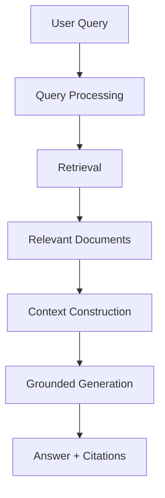

> 💡 **The objective is not only to retrieve relevant information** — it is to *control what information reaches the generation model* and to **verify that the produced response can be traced back to retrieved evidence.**

---

# 🎯 Objectives

The project is designed around ten goals:

| # | Objective |
|:-:|---|
| 1 | Provide **domain-specific retrieval** |
| 2 | **Reduce unsupported** model generation |
| 3 | Keep **tenant data isolated** |
| 4 | Apply **authorization before** sensitive operations |
| 5 | **Secure document ingestion** end to end |
| 6 | Support both **local development** and **production storage** |
| 7 | Support **distributed rate limiting** |
| 8 | Keep **infrastructure components replaceable** |
| 9 | Provide **traceable citations** |
| 10 | Make **evaluation and verification repeatable** |

---

# ✨ Key Features

| Area | Capability |
|---|---|
| 🌐 **API** | FastAPI with automatic OpenAPI schema |
| 🏛️ **Architecture** | Clean / Hexagonal — independently testable layers |
| 🔍 **Retrieval** | Hybrid dense + lexical search |
| ⚖️ **Ranking** | Reciprocal Rank Fusion (RRF) + optional reranking |
| 🧭 **Routing** | Semantic query routing |
| 🗄️ **Storage** | PostgreSQL + pgvector |
| 💻 **Dev storage** | SQLite + in-memory vector store |
| ⚡ **Cache / Rate limit** | Redis (distributed backend) |
| 🔐 **Security** | Multi-tenant authorization, server-side authority |
| 🔗 **Grounding** | Citation-aware generation; **cannot be client-disabled** |
| 📥 **Documents** | Secure upload, validation and ingestion |
| 📊 **Evaluation** | Offline evaluation pipeline with golden datasets |
| 🐳 **Deployment** | Docker-oriented, dev/prod separation |
| 📈 **Observability** | Structured logging, health & readiness probes, retrieval tracing |

---

# 🧰 Tech Stack

| Layer | Technology | Purpose |
|---|---|---|
| **API** | FastAPI | HTTP interface, validation, OpenAPI docs |
| **Language** | Python 3.11+ | Core implementation |
| **Database** | PostgreSQL | Metadata, tenants, documents, chunks |
| **Vector search** | pgvector | Dense embedding storage & similarity search |
| **Dev database** | SQLite | Zero-setup local development |
| **Cache / limits** | Redis | Distributed rate limiting, shared state |
| **Embeddings** | Configurable provider | Query & chunk vectorisation |
| **Generation** | Configurable LLM provider | Grounded answer synthesis |
| **Reranking** | Pluggable reranker | Precision improvement over candidates |
| **Packaging** | Docker / Docker Compose | Reproducible environments |
| **Testing** | pytest | Unit, integration, security suites |
| **Linting** | Ruff | Fast static linting |
| **Typing** | mypy | Static type verification |

> ℹ️ Pin exact versions in `requirements.txt` / `pyproject.toml` and keep this table in sync with them.

---

# 🏗️ System Architecture

The architecture is intentionally divided into separate components so that **retrieval, storage, authentication, generation, and infrastructure concerns remain independently testable**.

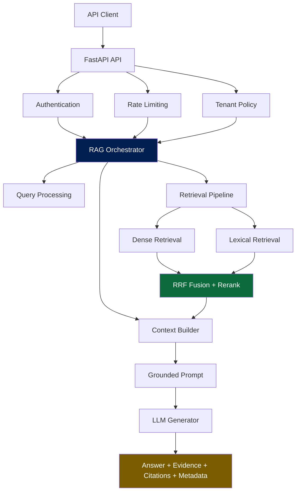

---

# 🔄 The RAG Pipeline

## 📥 Ingestion path

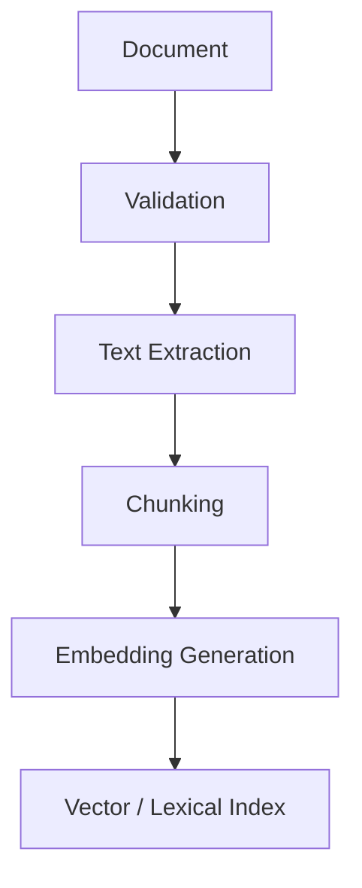

## 🔎 Query path

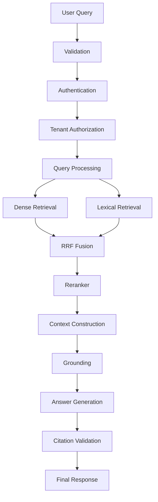

> 🔑 **Note the ordering:** authentication and tenant authorization happen **before** retrieval — not after generation. Unauthorized data must never enter the model's context. See [Why Tenant-Aware Retrieval?](#-architectural-decisions)

---

# 🧠 Query Processing

Incoming queries are **normalized and validated before retrieval**.

The processing layer is responsible for:

- ✅ input validation
- ✅ query normalization
- ✅ routing decisions
- ✅ retrieval configuration
- ✅ tenant-aware filtering
- ✅ context budget calculation
- ✅ retrieval tracing metadata

The system keeps query processing **separate from storage and generation**, so individual components can be replaced without modifying the API contract.

---

# 🔀 Hybrid Retrieval

The project uses **hybrid retrieval** rather than depending exclusively on dense vector similarity.

<table>
<tr>
<td width="50%" valign="top">

### 🧲 Dense (semantic) retrieval

**Strong when:** the wording of the query *differs* from the wording in the source document.

Handles paraphrase, synonyms, conceptual similarity.

</td>
<td width="50%" valign="top">

### 🔤 Lexical (term) retrieval

**Strong when:** the query contains exact tokens that carry the meaning.

Handles IDs, error strings, config keys, technical names.

</td>
</tr>
</table>

Combining both means neither failure mode silently dominates the result set.

---

# 🧲 Dense Retrieval

The dense path converts the user query into an **embedding** and searches the configured vector store.

| Environment | Backend |
|---|---|
| **Production** | PostgreSQL + pgvector |
| **Development** | Lightweight local / in-memory vector implementation |

The **storage abstraction** isolates vector operations from the orchestration layer — swapping backends does not touch retrieval logic.

---

# 🔤 Lexical Retrieval

The lexical path provides **term-sensitive matching**, which is critical for domain-specific information where exact tokens carry the meaning.

Typical cases where dense embeddings alone under-rank the right document:

```text
ERR_CONNECTION_RESET
HTTP 429
AUTH_TOKEN
postgresql
vector_store
tenant_id
```

- product identifiers
- technical names
- exact terminology
- IDs
- configuration values
- error messages
- exact phrases

---

# ⚖️ Reciprocal Rank Fusion

Independent retrieval strategies produce **separate rankings with non-comparable raw scores**. Rather than trying to normalize those scores against each other, the system fuses the *rankings*:

```text
RRF(d) = Σ  1 / (k + rank(d))
```

where `rank(d)` is the position of document `d` in an individual retrieval result set, and `k` is a smoothing constant.

> 💡 **The important architectural property:** retrieval strategies remain fully **independent**, while their ranked outputs are combined *before* reranking. No strategy needs to know about the others.

---

# 🎯 Reranking

After initial candidate retrieval, a reranking stage improves the ordering of the **most relevant** documents.

The reranker operates on **retrieved candidates only** — it never searches the entire corpus.

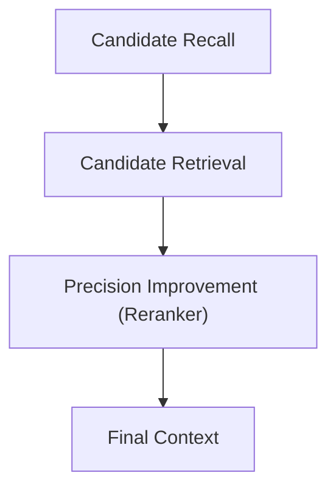

This separation means the **reranking implementation can change without rewriting the retrieval layer**.

---

# 📦 Context Construction

> ⚠️ **Retrieval results are not passed directly to the generation model.**

The context builder is responsible for:

| Responsibility | Why it matters |
|---|---|
| Selecting relevant chunks | Precision over volume |
| Limiting total context size | Controls prompt cost & latency |
| Preserving document metadata | Enables attribution |
| Preserving citation information | Enables traceability |
| Maintaining tenant boundaries | Prevents cross-tenant leakage |
| Avoiding unnecessary expansion | Reduces noise & distraction |
| Producing deterministic structure | Makes evaluation repeatable |

**Token-aware context construction** helps control prompt size and reduces unnecessary retrieval payload.

---

# 🔗 Grounding & Citations

The generated response must be **grounded in retrieved evidence**. The grounding layer maintains an explicit chain:

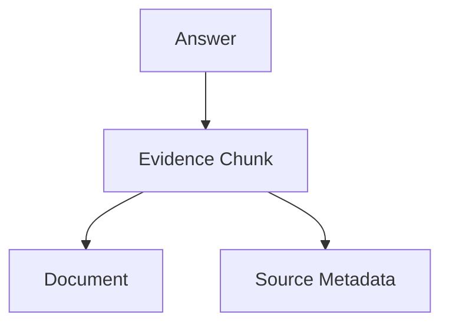

## 🚫 Grounding cannot be client-disabled

The application is designed so that grounding **cannot be turned off by a normal client request** when grounding is required by server configuration.

This prevents an API caller from bypassing a mandatory control by sending:

```json
{
  "enable_grounding": false
}
```

> 🔒 **Client configuration does not override server-enforced security or grounding requirements.** This is an instance of the broader [Server-Side Authority](#-secure-by-design-principles) principle.

---

# 📥 Document Ingestion

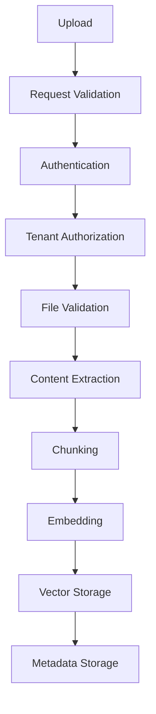

Each document is associated with **tenant-scoped metadata** so that retrieval operations can enforce the corresponding access boundary.

---

# 🛡️ Security Architecture

Security is not a module in this project — it is a set of **boundaries** that every request must cross.

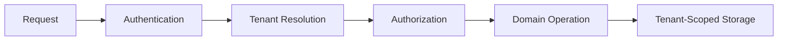

---

# 🔑 Authentication & Authorization

Authorization is performed **before** protected operations.

The project distinguishes four separate concerns:

| Concern | Question it answers |
|---|---|
| **Authentication** | Who is this caller? |
| **Tenant identification** | Which tenant scope do they belong to? |
| **Role / permission checks** | What are they allowed to do? |
| **Administrative target selection** | May they act on *another* tenant? |

- ❌ Normal users **cannot** elevate privileges by injecting arbitrary headers.
- ✅ Administrator-only operations **can** explicitly target another tenant — *when the authorization policy permits it*.

> 🔑 **The key security property:** tenant targeting is an **authorized administrative capability**, not a generic client override.

---

# 🏢 Multi-Tenant Architecture

Tenant isolation is a **core security boundary**.

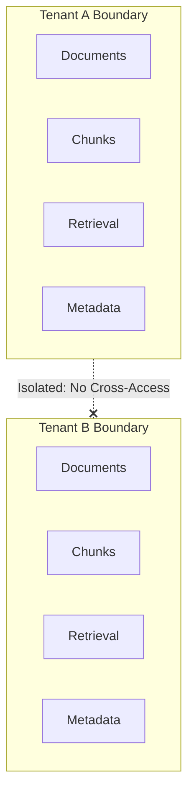

**A request belonging to Tenant A must not be able to retrieve or modify resources belonging to Tenant B.**

Therefore:

- Tenant identification is **not** treated as a freely client-controlled field.
- The **authenticated identity** determines the effective tenant scope for normal user operations.

---

# 🗝️ API Key Handling

> ⚠️ **API keys are authentication credentials — not tenant identifiers.**

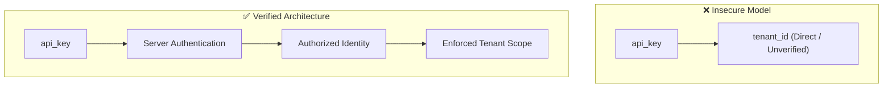

The system **authenticates the credential** and derives the authorized identity from the authenticated principal.

This avoids a common class of **confused-deputy** problems where a caller attempts to select a different tenant merely by changing an input parameter.

---

# 📤 Upload Security

> 🚨 **Uploaded documents are treated as untrusted input.**

The ingestion layer validates:

- [ ] file type
- [ ] filename characteristics
- [ ] size limits
- [ ] content consistency
- [ ] supported formats
- [ ] storage destination
- [ ] tenant ownership

The upload pipeline **must not assume** that a client-controlled filename or content type is trustworthy.

**Security validation occurs *before* the document is accepted** into the normal processing pipeline.

---

# 🚦 Rate Limiting

Rate limiting reduces abuse and accidental resource exhaustion.

| Environment | Backend |
|---|---|
| **Production (distributed)** | Redis as the shared rate-limiting backend |
| **Development** | In-process limiter where appropriate |

> ⚠️ The production design **avoids relying exclusively on process-local memory** when multiple application instances are expected to share the same rate limit.

## 🎯 Rate-Limit Identity

Rate-limit identity **must not** be derived directly from unvalidated credential strings.

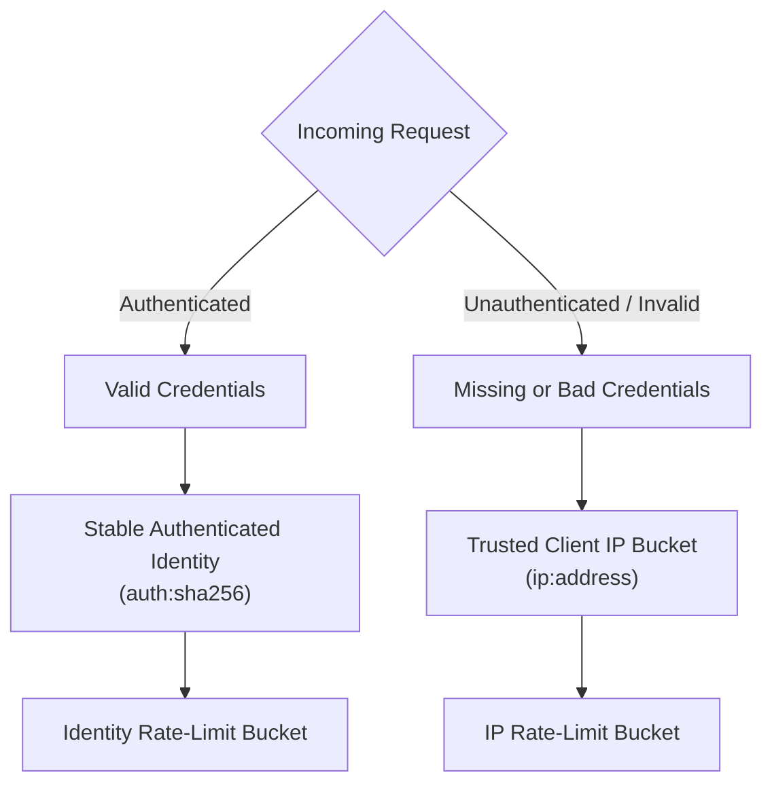

**Why this matters:** otherwise an attacker bypasses limits simply by **rotating arbitrary invalid API-key strings**, creating unlimited independent buckets.

---

# 🎭 Threat Model

The system assumes the following — every one of these is treated as *expected*, not exceptional:

| Assumption |
|---|
| 🎭 API clients may be **malicious** |
| 📁 Uploaded files may be **malicious** |
| 📨 Request headers may be **forged** |
| 🏷️ User-controlled metadata **cannot be trusted** |
| 🔑 Credentials may be **invalid, stolen, or rotated** |
| 🏢 A tenant may **intentionally attempt** to access another tenant's resources |
| 🤖 Model output may contain **unsupported statements** |
| 💥 Infrastructure dependencies **may become unavailable** |

The security model therefore establishes **explicit trust boundaries**.

---

# 🚧 Trust Boundaries

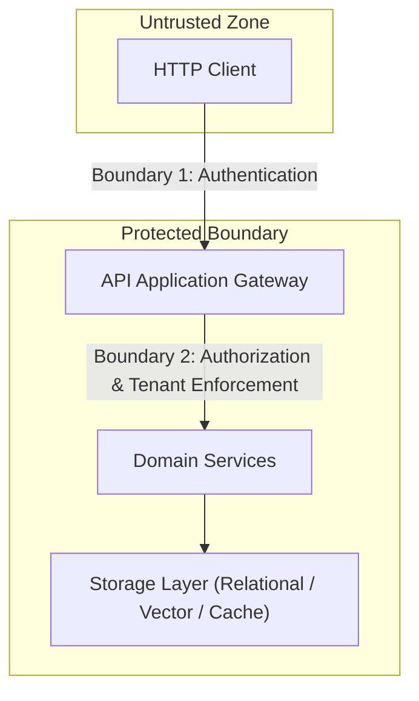

> 🔒 **User input should never be assumed trustworthy merely because it arrived through the API.**

---

# 🧱 Secure-by-Design Principles

<table>
<tr>
<td width="50%" valign="top">

### 🏛️ Server-Side Authority

Security-sensitive decisions are made by the **server**, never by trusting client-provided role or tenant information.

</td>
<td width="50%" valign="top">

### 🎯 Least Privilege

A principal receives **only** the access required by its authorization scope — nothing more.

</td>
</tr>
<tr>
<td width="50%" valign="top">

### 🧅 Defense in Depth

Security is implemented across **nine** layers: authentication · authorization · tenant enforcement · validation · storage · rate limiting · grounding · logging · deployment.

</td>
<td width="50%" valign="top">

### 🚪 Fail Closed

Security-critical infrastructure **must not silently downgrade** to an insecure mode in production.

</td>
</tr>
</table>

---

# 🚫 Production Restrictions

Development-only features **must not** be enabled in production:

- ❌ no-op authentication
- ❌ insecure mock infrastructure
- ❌ unsafe development defaults
- ❌ local-only memory storage where distributed infrastructure is required

> ⚠️ **The environment configuration is therefore part of the security boundary** — not just an operational detail.

---

# 🗄️ Storage Architecture

The application separates **domain logic** from **storage implementations**.

### 🏭 Production Storage

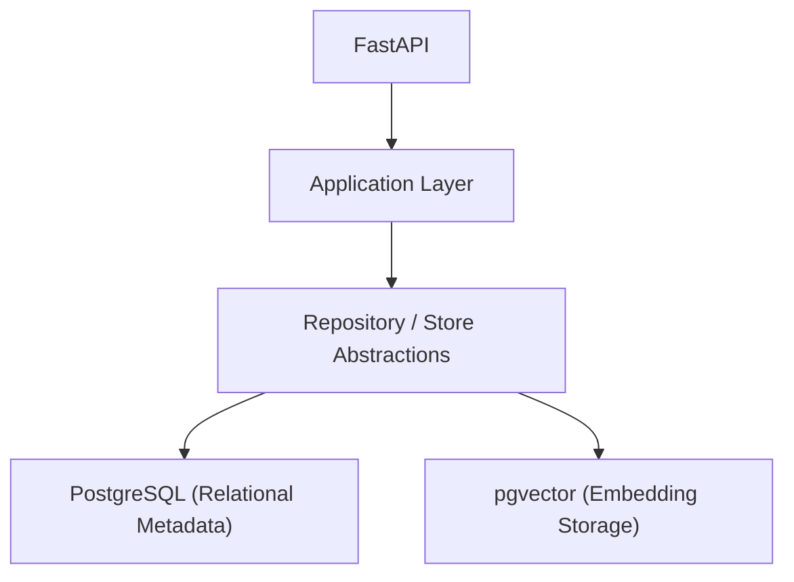

### 💻 Development Storage

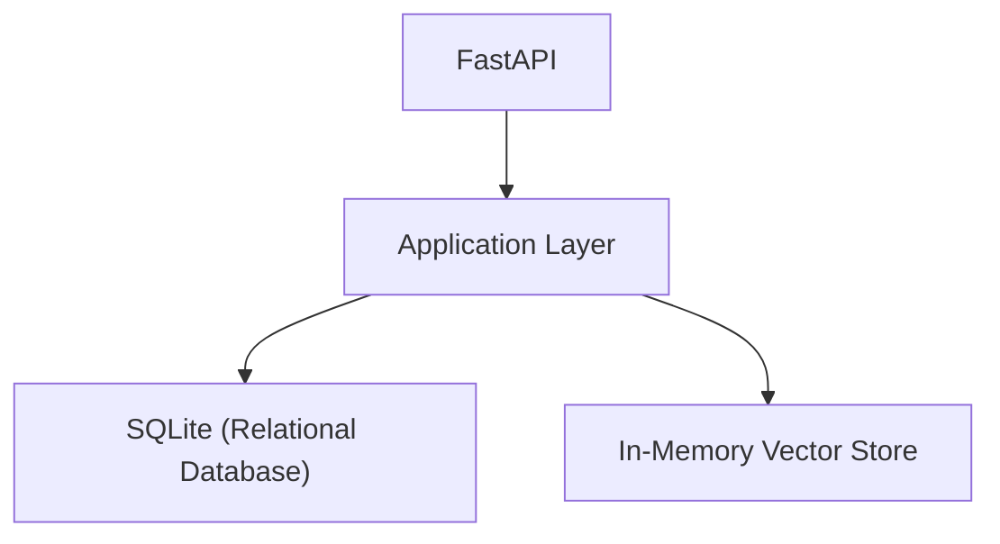

This makes local development possible **without requiring the full production infrastructure stack**.

---

# 🐘 PostgreSQL & pgvector

Production vector storage is designed around **PostgreSQL with pgvector**, providing a single database boundary for:

- application metadata
- tenant data
- document records
- chunk metadata
- vector representations

The **repository abstraction** keeps application logic independent from the underlying database implementation.

---

# ⚡ Redis

Redis provides infrastructure services including **distributed rate limiting**.

> 🔐 Production environments should configure **authentication** and appropriate **network restrictions** for Redis rather than relying on insecure development defaults.

The application can **fail closed** where a required distributed security control cannot safely be provided.

---

# 💻 Development Architecture

The development configuration is intentionally **lightweight**. It can operate using:

- SQLite
- local / in-memory vector storage
- development-safe components
- offline-compatible tokenization fallbacks where supported

This avoids forcing developers to run the entire production infrastructure stack for basic local work.

> ⚠️ **Development-only authentication behavior must remain disabled in production and staging environments.**

---

# 🏭 Production Architecture

A production deployment uses dedicated infrastructure for PostgreSQL, pgvector, Redis, application containers, a reverse proxy with TLS termination, and external or hosted model services where required.

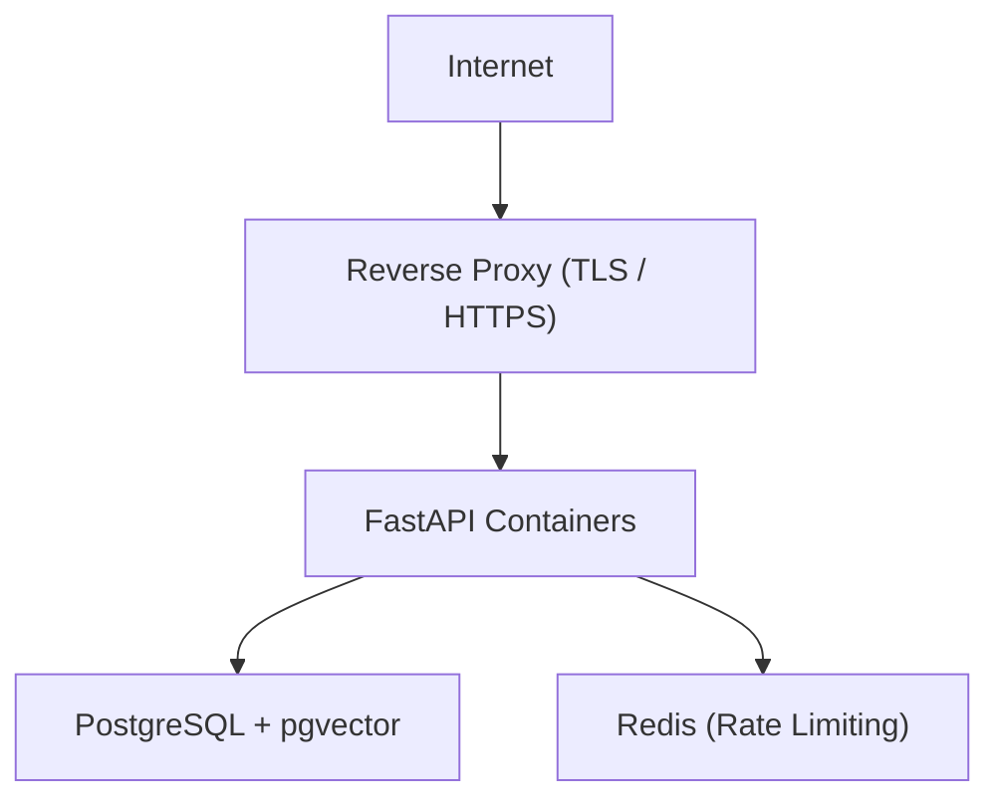

---

# 🐳 Docker

The project includes Docker-oriented deployment configuration.

```bash
docker compose build
```

```bash
docker compose up
```

> ⚠️ The exact production deployment should be adapted to the hosting platform and security requirements.
> **Do not treat a local Docker Compose configuration as equivalent to a fully hardened production deployment.**

---

# ❤️ Health & Readiness

These are **intentionally separate concepts**:

<table>
<tr>
<td width="50%" valign="top">

### 💓 Health check

> *Is the application process **alive**?*

</td>
<td width="50%" valign="top">

### ✅ Readiness check

> *Is the application capable of **serving traffic safely**?*

</td>
</tr>
</table>

A process may be **healthy while still being unavailable** — because a required dependency such as PostgreSQL or Redis is not ready.

> 💡 Deployment systems should use **readiness semantics** when deciding whether an instance should receive traffic.

---

# 📈 Observability

The application supports operational visibility through:

- structured logging
- request correlation
- error categorization
- health checks
- readiness checks
- retrieval tracing
- evaluation metrics

## 🔏 Logging & Privacy

Sensitive request content **should not** be unnecessarily written to logs.

<table>
<tr>
<td width="50%" valign="top">

**✅ Prefer**

```text
query_length
query_hash
request_id
tenant_id
operation
latency
status
```

</td>
<td width="50%" valign="top">

**❌ Avoid**

```text
full user prompt
document body
credentials
tokens
PII
```

</td>
</tr>
</table>

> ⚠️ Prompts may contain sensitive data. Log **derived signals**, not raw content.

---

# ⚠️ Error Handling

Application errors are separated into **predictable categories**:

```text
Validation Error          Retrieval Error
Authentication Error      Storage Error
Authorization Error       Dependency Error
Tenant Isolation Error    Generation Error
Upload Error              Rate Limit Error
```

> 🔒 The API exposes **safe client-facing error information** without revealing internal stack traces, credentials, database details, or other sensitive implementation information.

---

# 🌐 API

The application exposes HTTP APIs through FastAPI. Typical operations include:

| Category | Operations |
|---|---|
| 🔑 **Auth** | authentication, token issuance |
| 📥 **Documents** | upload, list, delete, manage |
| 🔍 **Retrieval** | search, hybrid query |
| 💬 **Q&A** | grounded question answering |
| ❤️ **Ops** | health, readiness |
| 🛠️ **Admin** | administrative, tenant-scoped operations |

> ℹ️ Exact routes are **implementation details of the current API version** and should be verified against the running OpenAPI schema.
> FastAPI automatically exposes API documentation when enabled — typically at `/docs` and `/redoc`.

---

# 📨 Example Request

**Request**

```http
POST /api/v1/query HTTP/1.1
Content-Type: application/json
Authorization: Bearer <token>
```

```json
{
  "query": "How does the authentication flow work?"
}
```

**Response (conceptual shape)**

```json
{
  "answer": "…grounded answer…",
  "citations": [
    {
      "document_id": "…",
      "chunk_id": "…",
      "source": "…",
      "score": 0.0
    }
  ],
  "metadata": {
    "request_id": "…",
    "retrieval": { "dense": 0, "lexical": 0, "fused": 0 },
    "grounded": true
  }
}
```

> ℹ️ A successful response exposes the answer **together with relevant evidence and citation metadata**, according to the current response schema. Verify field names against your live OpenAPI spec before documenting them as stable.

---

# 🚀 Quick Start

### 1️⃣ Clone the repository

```bash
git clone <repository-url>
cd <repository-directory>
```

### 2️⃣ Create a virtual environment

<details>
<summary><b>Windows (PowerShell)</b></summary>

<br>

```powershell
python -m venv .venv
.venv\Scripts\Activate.ps1
```

<br>

> ℹ️ If activation is blocked by execution policy:
> `Set-ExecutionPolicy -Scope Process -ExecutionPolicy Bypass`

</details>

<details open>
<summary><b>Linux / macOS</b></summary>

<br>

```bash
python -m venv .venv
source .venv/bin/activate
```

</details>

### 3️⃣ Install dependencies

```bash
pip install -r requirements.txt
```

For development tooling:

```bash
pip install -r requirements-dev.txt
```

### 4️⃣ Configure the environment

Copy the project's environment template and fill in your values — see [Environment Configuration](#-environment-configuration).

### 5️⃣ Run the API

```bash
uvicorn <module>:app --reload
```

> ℹ️ The exact module path follows the repository's current structure.

### 6️⃣ Verify it works

```bash
pytest -q
ruff check .
mypy .
```

---

# ⚙️ Environment Configuration

Create an environment file based on the project's environment template.

Typical configuration categories:

| Category | Example variables |
|---|---|
| **Database** | `DATABASE_URL` |
| **Cache / limits** | `REDIS_URL` |
| **Auth** | `API_KEY`, auth configuration |
| **Model** | model provider & name |
| **Embeddings** | embedding model & dimensions |
| **RAG** | chunk size, top-k, RRF `k`, token budget |
| **Rate limiting** | window, max requests, backend |
| **Uploads** | max file size, allowed types |
| **Logging** | level, format, privacy policy |
| **Environment** | `ENVIRONMENT=development \| staging \| production` |

> 🚨 **Secrets should be injected through the runtime environment or a dedicated secret-management mechanism.**
> **Do not commit real credentials to source control.**

---

# 🔐 Security Configuration

Production environments must **explicitly** configure:

- [ ] authentication
- [ ] authorization
- [ ] tenant isolation
- [ ] database credentials
- [ ] Redis credentials
- [ ] TLS / reverse proxy settings
- [ ] upload limits
- [ ] rate limits
- [ ] trusted proxy configuration
- [ ] logging policy
- [ ] secret management

> ⚠️ **Development defaults must not silently become production credentials.**

---

# 📊 Evaluation

RAG evaluation should consider **multiple dimensions** rather than relying only on whether an answer was generated.

| Dimension | What it measures |
|---|---|
| Retrieval relevance | Did the right chunks come back? |
| Context relevance | Was the assembled context useful? |
| Recall | Were all needed documents found? |
| Precision | Were irrelevant documents excluded? |
| MRR | How high did the first correct result rank? |
| Answer groundedness | Is every claim supported by evidence? |
| Citation accuracy | Do citations point at the right sources? |
| Answer similarity | Closeness to the reference answer |
| Response latency | Time to first / full response |

Evaluation must **clearly distinguish** between:

```text
Synthetic / Offline Evaluation
```
```text
Live Evaluation Against Real Infrastructure
```

> 🚨 **Synthetic benchmark numbers must not be presented as production performance** unless they have been independently validated under the intended deployment conditions.

---

# 🧪 Evaluation Methodology

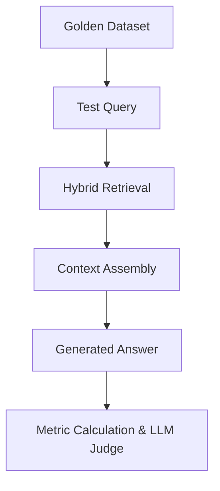

Evaluation datasets should contain **representative questions and expected evidence**.

A benchmark must document:

| Item | Why |
|---|---|
| Dataset source | Provenance & licensing |
| Dataset size | Statistical meaning |
| Retrieval configuration | top-k, fusion, reranking on/off |
| Model configuration | Generator + embedding model versions |
| Environment | dev / staging / production |
| Hardware | CPU/GPU, memory, region |
| Latency measurement method | Cold vs warm, percentile used |
| Metric definitions | Exact formula per metric |
| Pass/fail criteria | Decided *before* the run |

> 💡 Documenting these prevents benchmark values from being **interpreted without context**.

---

# 🧪 Testing

The test suite covers multiple layers.

<table>
<tr>
<td width="33%" valign="top">

### 🔹 Unit Tests

Validate isolated functions and components.

- chunking
- ranking
- RRF
- context budgeting
- metadata validation
- authorization rules

</td>
<td width="33%" valign="top">

### 🔸 Integration Tests

Validate interactions among:

- FastAPI
- database repositories
- vector store
- authentication
- Redis
- retrieval pipeline

</td>
<td width="34%" valign="top">

### 🔺 Security Tests

Validate:

- tenant isolation
- authorization boundaries
- header spoofing resistance
- upload validation
- rate-limit behavior
- API-key handling
- grounding enforcement

</td>
</tr>
</table>

### ▶️ Running tests

```bash
pytest -q
```

More detailed output:

```bash
pytest -v
```

Coverage can be generated when the configured development dependencies are available.

---

# 🔬 Static Analysis

The development workflow includes:

```bash
ruff check .
```

```bash
mypy .
```

> ℹ️ The exact command may vary with the repository configuration.
> ⚠️ **Static-analysis results should be reported using the results of the *current* commit** — never copied from an older verification run.

---

# 🔒 Security Verification

Security verification explicitly tests **attack-style scenarios** — not just happy paths. Each scenario has a defined expected outcome, so a regression is detectable rather than assumed.

<table>
<tr>
<td width="34%" valign="top">

### 🔺 Attack scenario

</td>
<td width="66%" valign="top">

### ✅ Expected result

</td>
</tr>
<tr>
<td valign="top">

**🎯 Privilege Escalation**

Attempt to inject a privileged role through request headers.

</td>
<td valign="top">

**Enforcement:** Authorization remains strictly based on server-authenticated identity.

</td>
</tr>
<tr>
<td valign="top">

**🏷️ Tenant Spoofing**

Attempt to change the tenant identifier of a normal-user request.

</td>
<td valign="top">

**Enforcement:** Tenant scope cannot be modified by an unauthorized client.

</td>
</tr>
<tr>
<td valign="top">

**🧾 Metadata Tenant Override**

Attempt to create or modify a resource under another tenant through metadata.

</td>
<td valign="top">

**Enforcement:** Server-side tenant ownership remains authoritative.

</td>
</tr>
<tr>
<td valign="top">

**🔀 Cross-Tenant Retrieval**

Create resources in Tenant A and Tenant B, then query from each.

</td>
<td valign="top">

**Enforcement:** Each tenant can only retrieve its own authorized resources.

</td>
</tr>
<tr>
<td valign="top">

**🔑 Invalid API-Key Rotation**

Send large numbers of requests using constantly changing invalid credentials.

</td>
<td valign="top">

**Enforcement:** Invalid credentials cannot create unlimited independent rate-limit buckets.

</td>
</tr>
<tr>
<td valign="top">

**🚫 Grounding Bypass**

Attempt to disable mandatory grounding via a client-controlled request parameter.

</td>
<td valign="top">

**Enforcement:** Server-side grounding policy remains strictly enforced.

</td>
</tr>
</table>

> 💡 Every row above should exist as an **automated test**, not just a documented intention. See the `tests/security/` directory.

---

# ✅ Verification Results

Current verified execution status tied to Git commit [`af2e43c`](file:///k:/Downloads/rag_project):

| Check | Result | Commit / Source | Date | Environment |
| :--- | :--- | :--- | :--- | :--- |
| **pytest** | 450/450 passed (100%), 0 failed, 0 skipped, 0 errors | `af2e43c` | 2026-09-17 | Windows 11 / Python 3.12.13 |
| **ruff check** | 0 issues (All checks passed!) | `af2e43c` | 2026-09-17 | Windows 11 / Ruff 0.16.6 |
| **ruff format** | 251 files formatted and verified clean | `af2e43c` | 2026-09-17 | Windows 11 / Ruff 0.16.6 |
| **mypy (strict)** | 0 issues in 234 source files | `af2e43c` | 2026-09-17 | Windows 11 / Mypy 2.3.1 |
| **Live HTTP Server Verification** | 7/7 suites passed (startup, OpenAPI 17 routes, `/health`, `/ready`, API smoke test with doc upload/query, tenant isolation & spoofing blocks, invalid-key rate limiting, grounding bypass enforcement) | `af2e43c` | 2026-09-17 | Local TCP `127.0.0.1:8000` / Uvicorn |
| **16-Step Smoke Test** | 16/16 steps passed cleanly | `af2e43c` | 2026-09-17 | Windows 11 / Local SQLite + In-Memory |
| **Distribution Hygiene** | 100% clean archive (`dist/domain_rag_release.zip`) | `af2e43c` | 2026-09-17 | 0 caches, 0 `.pyc`, 0 `.db`, 0 uploads, 0 `.env` |
| **Eval — synthetic offline** | 16/16 samples passed (`MockLLMJudge`) | `af2e43c` | 2026-09-17 | Offline Golden Dataset (16 samples) |
| **Docker verification** | **NOT RUN — Docker unavailable** (Docker CLI not installed on host) | `af2e43c` | 2026-09-17 | Host environment limitation (honest reporting) |

> 🔒 **Rules for this section**
> 1. Every number is reproducible from the current repository state.
> 2. Every benchmark states dataset, environment and measurement method.
> 3. If a check was not run, it is explicitly reported as **"Not run"** with the reason.
> 4. Latency figures and mock benchmark figures are never represented as live production metrics.

---

# 📜 Verification Policy

This README **intentionally does not hard-code historical claims** such as:

| ❌ Never write this without a current run |
|---|
| `449/449 tests passed` |
| `100% security` |
| `84.5 ms latency` |
| `100% production ready` |

Those values should only be added **after the corresponding verification has actually been executed against the current repository state**, and they belong in [Verification Results](#-verification-results) with their commit SHA attached.

> 💡 **Why this matters:** a stale number in a README is worse than no number. It misleads reviewers, it goes silently out of date, and — in a security-focused project — it undermines the credibility of every other claim in the document.

---

# 🔁 Reproducibility

Verification results must always be tied to:

- commit / version
- Python version
- dependency versions
- operating environment
- configuration
- model versions
- database / vector-store configuration

> ℹ️ A README should describe **how** verification is performed. The **actual results** should be generated from the current version of the project.

---

# 🤔 Architectural Decisions

<details open>
<summary><b>Why Hybrid Retrieval?</b></summary>

<br>

Dense retrieval captures **semantic similarity** while lexical retrieval preserves **exact term matching**. Neither alone is sufficient for domain content: dense misses exact identifiers, lexical misses paraphrase.

</details>

<details>
<summary><b>Why RRF?</b></summary>

<br>

RRF combines **independently ranked** retrieval results *without requiring raw scores from different systems to be directly comparable*. Score normalization across heterogeneous retrievers is fragile; rank fusion is not.

</details>

<details>
<summary><b>Why PostgreSQL + pgvector?</b></summary>

<br>

It allows **application metadata and vector data to live within a familiar relational database architecture** — one backup story, one permission model, one transactional boundary, and joins between metadata and embeddings.

</details>

<details>
<summary><b>Why Redis?</b></summary>

<br>

**Distributed rate limiting requires a shared state mechanism** when multiple application instances are running. Process-local counters would let total throughput scale with replica count, defeating the limit.

</details>

<details>
<summary><b>Why SQLite for Development?</b></summary>

<br>

It **lowers local setup requirements** and allows contributors to work without starting the complete production infrastructure stack. Faster onboarding, fewer broken local environments.

</details>

<details>
<summary><b>Why Tenant-Aware Retrieval?</b></summary>

<br>

**Retrieval itself must respect authorization boundaries.** Filtering only *after* generation is insufficient — because unauthorized data must never enter the context supplied to the model. Once it is in the prompt, the boundary has already been crossed, regardless of what the final answer says.

</details>

---

# ⚖️ Engineering Tradeoffs

The project intentionally balances five competing concerns:

```text
   Security
      +
   Maintainability
      +
   Local Developer Experience
      +
   Production Architecture
      +
   Evaluation
```

| Choice | Gains | Costs |
|---|---|---|
| **Simpler architecture** | Fewer dependencies, faster setup | Weaker production guarantees |
| **Full production stack** | Distributed rate limiting, persistent vector storage | Higher operational complexity |

> 💡 There is no free lunch here. The project chooses **production-grade guarantees** and pays for them with **operational complexity** — while keeping the *development* path lightweight so contributors aren't blocked by it.

---

# 🚧 Known Limitations

> ⚠️ **This repository should not be described as universally secure or universally production-ready without environment-specific validation.**

| Limitation |
|---|
| 🤖 Model quality depends on the **selected generation and embedding models** |
| 🔍 Retrieval quality depends on **document quality and chunking** |
| 📊 Evaluation numbers depend on the **evaluation dataset** |
| ⏱️ Latency depends on **infrastructure and model providers** |
| 💻 Local development storage **does not represent production-scale storage** |
| 🌐 External dependencies **can affect system availability** |
| 🔐 Deployment security depends on **reverse proxy, TLS, network and secret management** configuration |

---

# 🚀 Deployment Considerations

Before deployment, verify:

- [ ] production secrets are configured
- [ ] TLS is correctly configured
- [ ] trusted proxy configuration is correct
- [ ] PostgreSQL is reachable
- [ ] pgvector is available
- [ ] Redis authentication is enabled
- [ ] rate limiting uses the intended **distributed** backend
- [ ] development authentication is **disabled**
- [ ] upload limits are appropriate
- [ ] logging does not expose sensitive content
- [ ] health and readiness probes are configured
- [ ] database migrations are applied
- [ ] backups are configured where required

---

# 🧹 Release Hygiene

Generated artifacts should **not** accidentally become part of the source distribution.

Before creating a release archive, verify it does **not** contain:

```text
.git/
.venv/
__pycache__/
.pytest_cache/
.mypy_cache/
.ruff_cache/
large temporary artifacts
local secrets
generated nested release archives
```

> 💡 The release process should generate the distribution from a **clean source tree**.

---

# 📁 Project Structure

A representative structure:

```text
.
├── alembic/              # Database migration environments and revisions
│   ├── versions/         # Alembic migration revisions
│   └── env.py            # Async migration runner
├── app/                  # Application core, API, RAG subsystems, security
│   ├── api/              # HTTP routers, dependency injection, rate limiting
│   ├── core/             # Configuration, database engine, structured logging
│   ├── models/           # SQLAlchemy ORM relational and vector models
│   ├── observability/    # Metrics collector, tracing, secret sanitization
│   ├── rag/              # Retrieval, chunking, embeddings, reranking, context
│   ├── repositories/     # Repository persistence abstractions and SQLAlchemy impls
│   ├── schemas/          # Pydantic validation models and request/response DTOs
│   ├── security/         # Authorization, upload security guard, prompt guards
│   ├── services/         # Orchestration, ingestion, and chunking services
│   ├── ui/               # Embedded interactive dashboard interface
│   └── main.py           # Application factory and lifespan definition
├── data/                 # Local uploads storage directory
├── dist/                 # Clean distribution package output
├── eval_reports/         # Quantitative evaluation reports
├── scripts/              # Verification, clean packaging, and maintenance tooling
├── tests/                # Automated unit and integration test suite
│   ├── unit/             # Isolated unit tests for all components
│   └── integration/      # Pipeline, database, and end-to-end integration tests
├── Dockerfile            # Multi-stage production container specification
├── docker-compose.yml    # Production multi-container composition
├── pyproject.toml        # Project metadata and dependencies
├── run_eval.py           # Quantitative RAG benchmark evaluation runner
└── README.md
```

> ⚠️ **The exact tree must be kept synchronized with the repository.**

---

# ⌨️ Development Commands

| Task | Command |
|---|---|
| Run tests | `pytest -q` |
| Verbose tests | `pytest -v` |
| Lint | `ruff check .` |
| Type check | `mypy .` |
| Run API (dev) | `uvicorn <module>:app --reload` |
| Build images | `docker compose build` |
| Start stack | `docker compose up` |

> ℹ️ The exact module path should follow the repository's current structure.

---

# 🔮 Future Improvements

<table>
<tr>
<td width="50%" valign="top">

**Retrieval & Quality**
- stronger automated retrieval evaluation
- larger domain-specific golden datasets
- configurable reranking models
- improved citation verification
- semantic cache policies
- automated regression benchmarks

</td>
<td width="50%" valign="top">

**Platform & Ops**
- asynchronous ingestion workers
- background document processing
- object storage integration
- richer observability & distributed tracing
- model / provider failover
- document versioning
- expanded adversarial security testing

</td>
</tr>
</table>

---

# 🎓 Resume-Relevant Engineering Highlights

This project demonstrates practical experience across:

<table>
<tr>
<td width="33%" valign="top">

**🤖 AI / ML**
- RAG
- LLM application architecture
- Vector search
- pgvector
- Hybrid information retrieval
- Reranking
- NLP
- Evaluation methodology

</td>
<td width="33%" valign="top">

**🔐 Security**
- Authentication
- Authorization
- Multi-tenancy
- Tenant isolation
- Secure file processing
- API rate limiting
- Threat modelling

</td>
<td width="34%" valign="top">

**⚙️ Engineering**
- Python
- FastAPI
- REST API design
- PostgreSQL
- Redis
- Docker
- Automated testing
- Static analysis
- Observability

</td>
</tr>
</table>

---

# ⚠️ Security Disclaimer

> 🚨 **This repository is an engineering project and should not be interpreted as a guarantee of security for every deployment environment.**

Production security depends on:

| Factor |
|---|
| Infrastructure |
| Deployment configuration |
| Dependency versions |
| Secret management |
| TLS configuration |
| Network controls |
| Database permissions |
| Model providers |
| Operational procedures |

**Security verification should therefore be repeated for every deployment environment.**

---

# 📄 License

MIT — see [LICENSE](LICENSE) for details.

---

<div align="center">

**Built with a security-first, evaluation-driven approach to Retrieval-Augmented Generation.**

⭐ If this project was useful, consider starring the repository.

[Report a Bug](../../issues) · [Request a Feature](../../issues) · [Open a Discussion](../../discussions)

</div>
